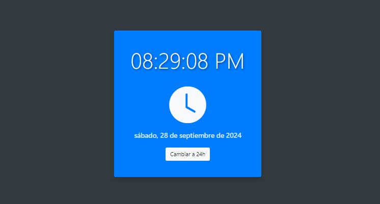

<div align="center">

# API-Clock
</div>

### Descripción General.
La "API-Clock" proporciona información sobre la hora actual en diferentes zonas horarias del mundo. Permite obtener datos como la fecha, la hora, la zona horaria y el estado del horario de verano en formato JSON. Esta API es útil para aplicaciones que necesitan mostrar la hora precisa o realizar operaciones relacionadas con la fecha y hora.

[](https://miguel-antonio-martinez-jimenez.github.io/ShieldedPass/Index.html)

<div align="center">
   
   Puedes acceder a una vista previa de la aplicación aquí: [API-Clock - Vista Previa](https://miguel-antonio-martinez-jimenez.github.io/API-Clock/)
</div>

## Objetivo.
El objetivo de la **API-Clock** es proporcionar información precisa y actualizada sobre la hora en diferentes zonas horarias del mundo. Esta herramienta permite a los desarrolladores integrar funcionalidades relacionadas con la hora y la fecha en sus aplicaciones, mejorando la experiencia del usuario en aplicaciones que requieren datos temporales.

## Características Principales.
- **Consulta de Zonas Horarias**: Permite obtener la hora actual para múltiples zonas horarias.
- **Formato de Respuesta en JSON**: La API devuelve datos en un formato JSON fácil de manejar.
- **Información Detallada**: Proporciona la hora actual, fecha, nombre de la zona horaria y estado del horario de verano.
- **Fácil Integración**: Puede ser utilizada en diversas aplicaciones web y móviles mediante solicitudes HTTP.

## Requisitos del Proyecto.
- **Requisitos Técnicos**:
  - **Software**: Navegador web moderno (Google Chrome, Mozilla Firefox, Microsoft Edge).
  - **Lenguajes utilizados**: JavaScript para la lógica de solicitudes y manejo de datos en el frontend. Para el backend, se utilizan Node.js y Express.
- **Requisitos de Sistema**:
  - Funciona en cualquier sistema operativo que soporte navegadores web (Windows, macOS, Linux).
- **Dependencias**:
  - **Node.js**: Entorno de ejecución para JavaScript en el backend.
  - **Express**: Framework para Node.js que facilita la creación de aplicaciones web.
  - **Nodemon**: Herramienta que permite reiniciar automáticamente el servidor de Node.js cuando se realizan cambios en el código.
> [!Important]
> Es importante asegurarse de que todos los requisitos estén instalados y configurados correctamente antes de ejecutar este proyecto para evitar problemas y asegurar un funcionamiento óptimo.

## Tecnologías Utilizadas.
- **HTML5**: Para estructurar el contenido de la aplicación web y definir la estructura básica del documento.
- **CSS3**: Para el diseño y estilo visual de la aplicación, asegurando una experiencia de usuario atractiva y responsiva.
- **JavaScript**: Para la lógica del cliente, incluyendo la interacción con la API del reloj, así como para manejar las solicitudes y manipular el DOM.
- **Node.js**: Entorno de ejecución para JavaScript que permite ejecutar código en el servidor.
- **Express**: Framework para Node.js que simplifica la creación de aplicaciones web y manejo de rutas.
- **Fetch API**: Para realizar solicitudes HTTP y manejar respuestas desde el servidor, facilitando la comunicación entre el frontend y el backend.
- **Bootstrap**: Framework CSS que proporciona componentes y estilos predefinidos para facilitar el desarrollo responsivo y moderno de la interfaz de usuario.

## Guía de Instalación.
1. Clonación del Repositorio: Clona el repositorio del proyecto desde GitHub o descarga el archivo ZIP.

   ```bash
   git clone https://github.com/Miguel-Antonio-Martinez-Jimenez/API-Clock.git
2. Accede a la carpeta del proyecto que has clonado.
3. Asegúrate de tener Node.js y npm instalados en tu sistema. Luego, instala las dependencias necesarias ejecutando el siguiente comando:
    ```bash
    npm install express nodemon
4. Inicia el servidor usando `npm start` o `npm run dev` para un desarrollo más fácil.

## Configuración Inicial.
No se necesita configuración especial de entorno ni instalación de dependencias. El proyecto está listo para ser usado directamente desde el navegador.

## Conexión con la Base de Datos.
Este proyecto no requiere un sistema de gestión de bases de datos. En su lugar, se emplean archivos para el almacenamiento y manejo de los datos.

## Acceso o Credenciales.
El proyecto no requiere acceso o credenciales específicas, ya que es una aplicación de cliente sin autenticación de usuario.

## Guía de Uso del Proyecto.
1. **Iniciar el Servidor**: Abre una terminal en la carpeta del proyecto y ejecuta node server.js o nodemon server.js.
2. **Abrir la Aplicación**: Navega a http://localhost:4008/ en tu navegador.
3. **Visualizar el Reloj**: Observa la hora y la fecha que se actualizan automáticamente.
4. **Cambiar el Formato de Hora**: Haz clic en "Cambiar a 24h" para alternar entre los formatos de 12 horas y 24 horas.
5. **Interacción con la API**: La hora se obtiene automáticamente del backend sin necesidad de acciones adicional

## Estructura del Proyecto.
- Estructura del proyecto **API-Clock**

  ```bash
  API-Clock/
  ├── public/
  │   ├── css/
  │   │   └── style.css
  │   ├── js/
  │   │   ├── script.js
  │   │   └── api-script.js
  ├── index.html
  ├── server.js
  ├── LICENSE
  └── README.md

## API.
Este proyecto utiliza un endpoint de API para obtener la hora actual. La API expone el siguiente endpoint:
- GET /api/clock: Devuelve la hora actual en formato JSON, incluyendo horas, minutos, segundos y formato AM/PM.
**Ejemplo de Respuesta**:
  ```bash
  {
      "hours": 12,
      "minutes": 30,
      "seconds": 45,
      "ampm": "PM"
  }

## Contribuciónes.
> [!Tip]
> Si deseas contribuir al proyecto, reportar errores o proponer mejoras, te invitamos a abrir un pull request o issue en el repositorio. También puedes contactarme directamente para compartir tus ideas o sugerencias a través de mi correo electrónico miguelantoniomartinezjimenez00@gmail.com. ¡Toda colaboración es bienvenida!

## Estado del Proyecto.
**Estado Actual:** `Finalizado`
> [!Note]
> Este proyecto se encuentra en estado **Finalizado**, lo que significa que todas las funcionalidades planeadas han sido implementadas y probadas satisfactoriamente. El código está disponible para su uso y estudio, y se aceptan contribuciones para mejoras o nuevas características.

## Testeo.
El proyecto se puede probar manualmente utilizando las funcionalidades de generación de contraseñas y copiado al portapapeles.

## Despliegue.
- Este proyecto puede ser desplegado en cualquier servidor que soporte Node.js.
- Para el despliegue:
  - Asegúrate de que el servidor tenga instaladas todas las dependencias (Express, Nodemon).
  - Copia el código del proyecto en el servidor.
  - Ejecuta el servidor utilizando node server.js o nodemon server.js.
  - Accede a la aplicación a través de la URL correspondiente (por ejemplo, http://your-server-address:4008/).
  - Recomendaciones: Considera usar plataformas como Heroku o Vercel para un despliegue más fácil y escalable.
 
## Problemas Conocidos y Limitaciones.
- **Compatibilidad del Navegador**: Algunas funciones, como la actualización automática de la hora, pueden no funcionar correctamente en navegadores muy antiguos.
- **Formato de Hora**: El botón para cambiar el formato de hora solo alterna entre 12 y 24 horas; no hay validación para asegurarse de que el formato se mantenga correctamente al cambiar.
- **Conexión al Servidor**: Si el servidor no está en funcionamiento, la aplicación no podrá mostrar la hora, y aparecerán errores de conexión en el navegador.

## Versiones.
- **Version Actual**: v2.9.

## Actualizaciones.
- Implementación de un reloj digital que muestra la hora actual.
- Integración con la API para obtener la hora actual de forma dinámica.
- Capacidad de alternar entre formato de 12 y 24 horas.
- Funcionalidad para actualizar automáticamente la hora cada segundo.
- Mejora en la interfaz de usuario con Bootstrap para un diseño responsivo y atractivo.

## Autores.
[MiguelMartinez30 - @DevDarkSonic](https://github.com/Miguel-Antonio-Martinez-Jimenez)

## Licencia.
Este proyecto está licenciado bajo la Licencia MIT. Consulta el archivo LICENSE para más detalles.
